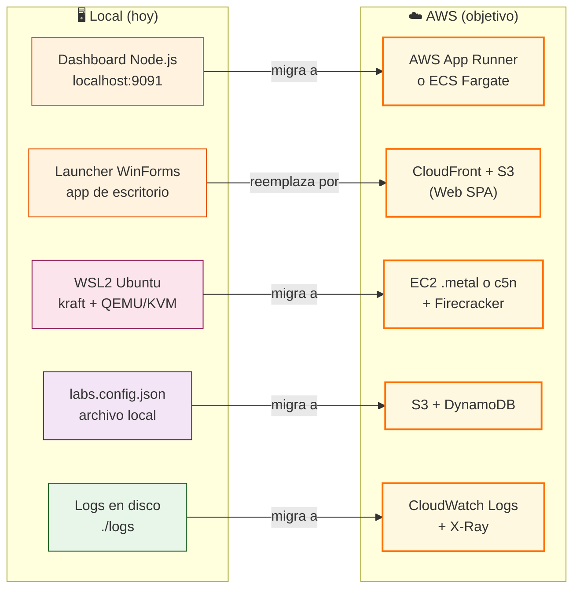
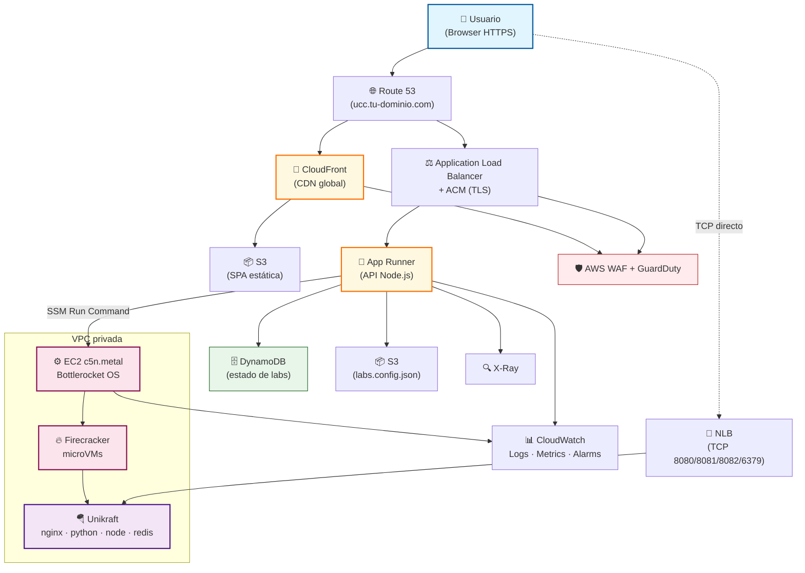
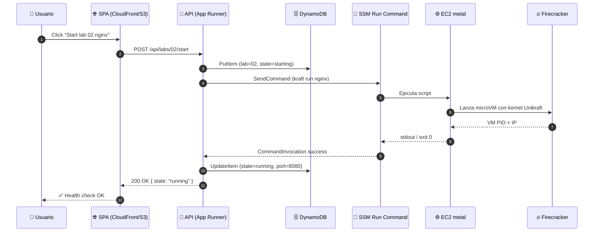
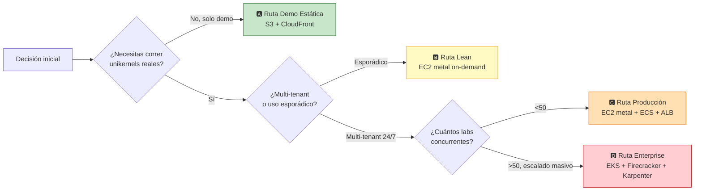
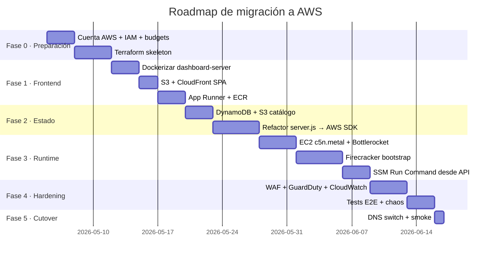
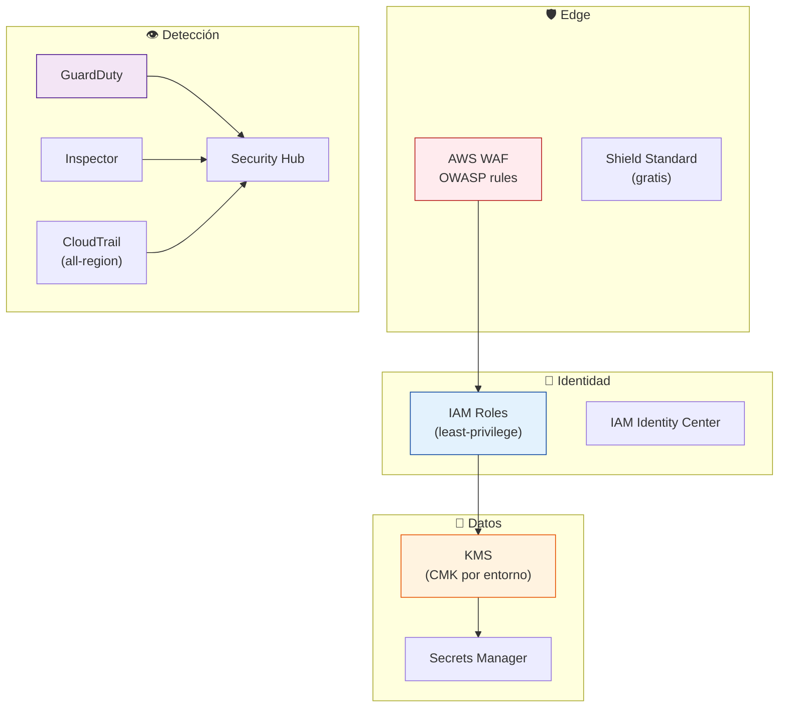
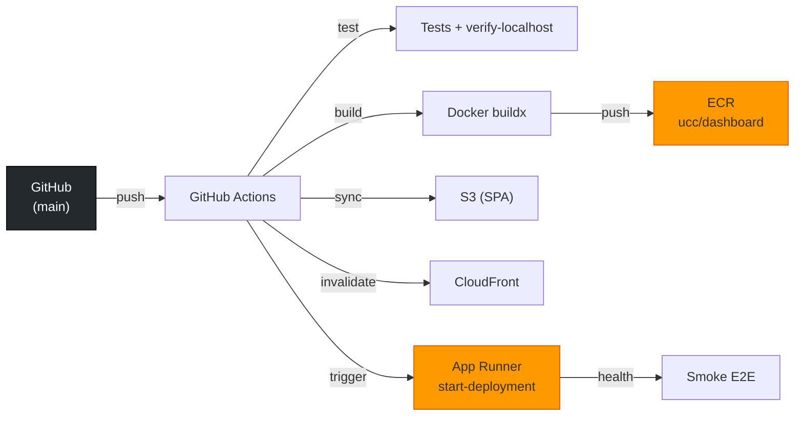

# ☁️ Migración a AWS · Unikernel Control Center


> 🚀 **Plan de migración a AWS** para llevar el stack `unikernel-labs` desde Windows + WSL2 (local) hacia una arquitectura **cloud-native, escalable y reproducible** sobre **Amazon Web Services**. Este documento analiza **múltiples caminos** (EC2 bare-metal, ECS Fargate, EKS, Lambda + Firecracker, App Runner, Amplify), entrega **paso a paso ejecutable**, **estimación de costos mensuales** y **trade-offs** para que elijas la ruta correcta según tu presupuesto y madurez operacional. ⚡

[](https://aws.amazon.com/)
[](https://docs.aws.amazon.com/general/latest/gr/rande.html)
[](https://www.terraform.io/)
[](https://unikraft.org/)
[](https://firecracker-microvm.github.io/)
[](#-costos-detallados)
[](#-fases-de-migración)
[](LICENSE)

---

## 🗺️ Tabla de contenidos

1. [🎯 Objetivo de la migración](#-objetivo-de-la-migración)
2. [🧩 Mapeo Local → AWS](#-mapeo-local--aws)
3. [🧱 Arquitectura objetivo](#-arquitectura-objetivo)
4. [🧰 Tecnologías AWS evaluadas](#-tecnologías-aws-evaluadas)
5. [📊 Comparativa de rutas](#-comparativa-de-rutas)
6. [🚦 Fases de migración](#-fases-de-migración)
7. [🪜 Paso a paso (Ruta recomendada)](#-paso-a-paso-ruta-recomendada)
8. [💸 Costos detallados](#-costos-detallados)
9. [🔐 Seguridad y compliance](#-seguridad-y-compliance)
10. [📈 Observabilidad](#-observabilidad)
11. [🔁 CI/CD en AWS](#-cicd-en-aws)
12. [🧯 Riesgos y mitigaciones](#-riesgos-y-mitigaciones)
13. [📚 Referencias](#-referencias)

---

## 🎯 Objetivo de la migración

Hoy, el **Unikernel Control Center** corre **localmente** sobre Windows + WSL2:

- 🪟 **Launcher .NET WinForms** — Solo Windows.
- 🖥️ **Dashboard Node.js** — `localhost:9091`.
- 🐧 **Runtime Unikraft** — `kraft` + QEMU/KVM dentro de WSL2.
- 🌐 **Servicios** — `nginx`, `python-http`, `node-http`, `redis` expuestos en `localhost`.

> [!IMPORTANT]
> El **valor diferencial** del proyecto es ejecutar **unikernels Unikraft reales** con virtualización por hardware (KVM). Cualquier ruta cloud debe **preservar la capacidad KVM** o reemplazarla por **Firecracker microVMs** (que es exactamente la base de AWS Lambda y Fargate desde 2018).

### Metas

| Meta | Estado local | Estado en AWS |
|---|---|---|
| 🌍 Acceso público vía HTTPS | ❌ solo `localhost` | ✅ ALB + ACM + Route 53 |
| 🔁 Deploy reproducible | ⚠️ scripts manuales | ✅ Terraform / CDK |
| 📈 Escalado horizontal | ❌ una máquina | ✅ ASG / ECS / EKS |
| 🛡️ Aislamiento por lab | ✅ unikernel | ✅ unikernel + IAM + SG |
| 💾 Catálogo persistente | `labs.config.json` local | ✅ S3 + DynamoDB |
| 🧪 Multi-usuario simultáneo | ❌ | ✅ |
| 💰 Costo controlado | $0 | desde **~$15/mes** (estática) hasta **~$320/mes** (full HA) |

---

## 🧩 Mapeo Local → AWS



| Componente local | Servicio AWS recomendado | Alternativa | Justificación |
|---|---|---|---|
| `dashboard-server/server.js` | **AWS App Runner** | ECS Fargate, Elastic Beanstalk | App Runner = deploy de container desde ECR con HTTPS automático y autoscaling, sin gestionar cluster. |
| `index.html` + `dashboard.js` + `dashboard.css` | **S3 + CloudFront** | Amplify Hosting | Web estática, CDN global, HTTPS, costo casi cero. |
| Launcher WinForms | **(Reemplazo Web)** | Workspaces / AppStream 2.0 | El launcher es UI de escritorio Windows; en cloud se reemplaza por la SPA del dashboard. |
| Runtime Unikraft (KVM) | **EC2 `c5n.metal` / `m5.metal`** | EC2 `*.metal` con Nitro, Bottlerocket | Necesitas **bare-metal** o **soporte KVM**; las instancias `.metal` exponen el hipervisor real. |
| Microservicios efímeros | **Firecracker** sobre EC2 metal | AWS Lambda (usa Firecracker internamente) | Firecracker es la microVM creada por AWS específicamente para correr unikernels y funciones. |
| `labs.config.json` | **S3 + DynamoDB** | AWS AppConfig, Parameter Store | S3 para JSON crudo, DynamoDB para estado por lab (start/stop/health). |
| Logs locales | **CloudWatch Logs** | OpenSearch | Recolección estándar, retención configurable, query con Logs Insights. |
| `verify-localhost.js` | **CodeBuild** | GitHub Actions (ya en uso) | Smoke test post-deploy. |
| Instalador Inno Setup `.exe` | **CodeArtifact + S3 release** | GitHub Releases (ya en uso) | El `.exe` puede seguir publicándose por GitHub; AWS no aporta valor aquí. |

---

## 🧱 Arquitectura objetivo

### Vista de alto nivel (ruta recomendada)



### Flujo de control: arrancar un lab



---

## 🧰 Tecnologías AWS evaluadas

### A · Compute (donde corre el unikernel)

| Servicio | Soporta KVM/Unikraft | Modelo | Cuándo usarlo |
|---|---|---|---|
| **EC2 `*.metal` (c5n, m5, m6i, c6i)** | ✅ KVM nativo | IaaS | **Recomendado** para correr `kraft run` real con QEMU/KVM o Firecracker. |
| **EC2 estándar (c5.large, t3.medium)** | ⚠️ Solo KVM si la familia lo permite (`*.metal`); las no-metal **no exponen KVM**. | IaaS | Sirve solo para emulación TCG (lento) o para el dashboard. |
| **AWS Fargate (ECS/EKS)** | ❌ no permite `/dev/kvm` | Serverless container | Solo para el **dashboard**, no para el unikernel. |
| **AWS Lambda** | 🔶 **internamente usa Firecracker** | FaaS | No expone Firecracker al usuario; útil para tareas de control (webhooks, cron). |
| **AWS App Runner** | ❌ container only | PaaS | Ideal para el **API Node.js** del dashboard. |
| **AWS Batch + EC2 metal** | ✅ | Batch | Para correr benchmarks (lab 06) bajo demanda. |
| **AWS Outposts / Snowball Edge** | ✅ | Híbrido | Si necesitas on-prem extendido a AWS. |

> [!TIP]
> **Firecracker** es OSS creado por AWS y es **el match natural para unikernels**. Puedes correrlo tú mismo sobre EC2 `*.metal` (necesita `/dev/kvm`). Lambda y Fargate lo usan por debajo, pero **no exponen el control plane** al usuario, por eso necesitas EC2 metal para el caso "labs unikernel reales".

### B · Frontend (Dashboard SPA)

| Servicio | Costo | HTTPS | CDN | Build automático |
|---|---|---|---|---|
| **S3 + CloudFront + ACM** | $ | ✅ | ✅ global | Manual / CI |
| **AWS Amplify Hosting** | $$ | ✅ | ✅ | ✅ desde Git |
| **App Runner** (servir static) | $$$ | ✅ | ❌ | ✅ |

**Recomendado:** S3 + CloudFront por costo y simplicidad.

### C · Persistencia y catálogo

| Servicio | Uso |
|---|---|
| **S3** | `labs.config.json`, artefactos de unikernel `.elf`, logs archivados. |
| **DynamoDB** | Estado en vivo: `{labId, state, pid, port, startedAt}`. Lectura sub-ms. |
| **SSM Parameter Store** | Secretos no críticos, tokens. |
| **AWS Secrets Manager** | Credenciales, claves SSH. |
| **EFS** | (Opcional) catálogo compartido entre múltiples EC2 metal. |

### D · Red

| Servicio | Rol |
|---|---|
| **VPC** | Aislamiento, subredes públicas/privadas. |
| **Application Load Balancer (ALB)** | HTTP/HTTPS al API y dashboard. |
| **Network Load Balancer (NLB)** | TCP directo a unikernels (8080, 8081, 8082, 6379). |
| **CloudFront** | CDN para SPA. |
| **Route 53** | DNS. |
| **AWS Certificate Manager (ACM)** | TLS gratis. |
| **AWS PrivateLink** | Exponer servicios sin salir a internet. |

### E · Seguridad

`AWS WAF` · `GuardDuty` · `Inspector` · `IAM` (least-privilege) · `KMS` · `CloudTrail` · `Security Hub`.

### F · CI/CD

`CodePipeline` · `CodeBuild` · `CodeDeploy` · `ECR` (registro de containers) · `CodeArtifact`.

> [!NOTE]
> El repo ya usa **GitHub Actions**. La estrategia recomendada es **mantener GitHub Actions** y delegar a AWS solo el `aws ecr push` y `aws apprunner start-deployment`. No duplicar pipelines.

---

## 📊 Comparativa de rutas



| Ruta | Complejidad | Costo/mes (us-east-1) | Casos de uso |
|---|---|---|---|
| 🅰️ **Demo estática** | ⭐ | **~$15** | Mostrar la UI sin ejecutar labs reales (mock API). |
| 🅱️ **Lean (on-demand)** | ⭐⭐ | **~$50–80** (con auto-stop) | Demos en vivo, talleres, dev personal. |
| 🅲 **Producción** | ⭐⭐⭐ | **~$320** | SaaS pequeño, equipo interno, recruiters. |
| 🅳 **Enterprise** | ⭐⭐⭐⭐⭐ | **$1.500+** | Multi-tenant, SLA 99.9%, miles de unikernels. |

---

## 🚦 Fases de migración



---

## 🪜 Paso a paso (Ruta recomendada)

### Prerrequisitos

```bash
# Cliente AWS
aws --version            # >= 2.15
terraform -version       # >= 1.7
docker --version         # para build local
gh auth status           # ya configurado en este repo
```

### 0 · Crear cuenta y baseline

```bash
# Configura perfil
aws configure sso --profile ucc-prod
aws sts get-caller-identity --profile ucc-prod

# Activa MFA root, crea usuario IAM admin, NO uses root.
# Crea AWS Budget de $50 con alerta al 80%.
aws budgets create-budget \
  --account-id $(aws sts get-caller-identity --query Account --output text) \
  --budget file://infra/aws/budget.json
```

### 1 · Bootstrap Terraform

```bash
mkdir -p infra/aws && cd infra/aws
terraform init
terraform workspace new prod
```

Estructura sugerida:

```text
infra/aws/
├── 00-providers.tf         # provider aws + backend s3
├── 10-network.tf           # VPC + subnets + NAT + IGW
├── 20-frontend.tf          # S3 + CloudFront + ACM + Route53
├── 30-api.tf               # ECR + App Runner + IAM
├── 40-state.tf             # DynamoDB + S3 catálogo
├── 50-runtime.tf           # EC2 c5n.metal + SG + SSM
├── 60-observability.tf     # CloudWatch + X-Ray
├── 70-security.tf          # WAF + GuardDuty
└── variables.tf
```

### 2 · Dockerizar `dashboard-server`

```dockerfile
# Dockerfile.dashboard
FROM node:20-alpine
WORKDIR /app
COPY dashboard-server/package*.json ./
RUN npm ci --omit=dev
COPY dashboard-server/ ./
COPY index.html dashboard.js dashboard.css ./public/
COPY labs.config.json ./
ENV PORT=9091 NODE_ENV=production
EXPOSE 9091
CMD ["node", "server.js"]
```

```bash
aws ecr create-repository --repository-name ucc/dashboard --profile ucc-prod
docker build -f Dockerfile.dashboard -t ucc-dashboard:latest .
docker tag ucc-dashboard:latest <ACCT>.dkr.ecr.us-east-1.amazonaws.com/ucc/dashboard:latest
aws ecr get-login-password --profile ucc-prod | docker login --username AWS --password-stdin <ACCT>.dkr.ecr.us-east-1.amazonaws.com
docker push <ACCT>.dkr.ecr.us-east-1.amazonaws.com/ucc/dashboard:latest
```

### 3 · Desplegar SPA estática

```bash
aws s3 mb s3://ucc-dashboard-spa --profile ucc-prod
aws s3 sync . s3://ucc-dashboard-spa \
  --exclude "*" \
  --include "index.html" --include "dashboard.js" --include "dashboard.css" \
  --include "assets/*" \
  --profile ucc-prod
# CloudFront + ACM cert se crea vía Terraform (20-frontend.tf)
terraform apply -target=module.frontend
```

### 4 · App Runner para la API

```bash
terraform apply -target=module.api
# Output esperado: api_url = https://xxxx.us-east-1.awsapprunner.com
```

### 5 · DynamoDB + catálogo en S3

```bash
aws s3 cp labs.config.json s3://ucc-catalog/labs.config.json --profile ucc-prod
terraform apply -target=module.state
```

> [!IMPORTANT]
> Ahora `dashboard-server/server.js` debe leer `labs.config.json` desde S3 (con `@aws-sdk/client-s3`) y persistir estado en DynamoDB en vez del filesystem local. Usa `IAM Role` del App Runner, no claves estáticas.

### 6 · EC2 metal + Firecracker

```bash
# Lanza una c5n.metal en subred privada
terraform apply -target=module.runtime

# User data del AMI (Bottlerocket o AL2023):
cat <<'EOF' > infra/aws/scripts/bootstrap-metal.sh
#!/usr/bin/env bash
set -euo pipefail
yum -y update
yum -y install qemu-system-x86_64 git make gcc bison flex iptables
# Instalar kraft
curl -sSf https://get.kraftkit.sh | sh
# Instalar Firecracker
ARCH=$(uname -m)
release_url="https://github.com/firecracker-microvm/firecracker/releases"
latest=$(basename $(curl -fsSLI -o /dev/null -w %{url_effective} ${release_url}/latest))
curl -L ${release_url}/download/${latest}/firecracker-${latest}-${ARCH}.tgz | tar -xz
install -m 0755 release-${latest}-${ARCH}/firecracker-${latest}-${ARCH} /usr/local/bin/firecracker
# Habilita SSM
systemctl enable --now amazon-ssm-agent
EOF
```

### 7 · Conectar API → EC2 vía SSM

En `dashboard-server/server.js`, reemplaza la llamada `wsl.exe` por:

```js
import { SSMClient, SendCommandCommand } from "@aws-sdk/client-ssm";
const ssm = new SSMClient({ region: "us-east-1" });

async function startLab(labId, instanceId) {
  const cmd = await ssm.send(new SendCommandCommand({
    InstanceIds: [instanceId],
    DocumentName: "AWS-RunShellScript",
    Parameters: { commands: [`cd /opt/labs/${labId} && kraft run --detach`] },
    TimeoutSeconds: 60,
  }));
  return cmd.Command.CommandId;
}
```

### 8 · NLB para exponer puertos de unikernels

```hcl
# 10-network.tf (extracto)
resource "aws_lb" "labs" {
  name               = "ucc-labs-nlb"
  load_balancer_type = "network"
  subnets            = aws_subnet.public[*].id
}
# Target groups: 8080 (nginx), 8081 (python), 8082 (node), 6379 (redis)
```

### 9 · Smoke test E2E

```bash
LAB_API=https://api.ucc.tu-dominio.com
curl -X POST $LAB_API/api/labs/02/start
sleep 5
curl https://nginx.ucc.tu-dominio.com   # debe responder 200 OK
node scripts/verify-localhost.js --base-url $LAB_API
```

### 10 · Cutover DNS

```bash
# Apunta tu dominio a Route 53 hosted zone
aws route53 change-resource-record-sets \
  --hosted-zone-id ZXXXX \
  --change-batch file://infra/aws/dns/cutover.json
```

---

## 💸 Costos detallados

### Ruta 🅰 · Demo estática (~$15/mes)

| Servicio | Configuración | Mensual |
|---|---:|---:|
| Route 53 zone | 1 hosted zone | $0.50 |
| ACM | TLS gratis | $0.00 |
| S3 | 1 GB + 100k GET | $0.05 |
| CloudFront | 50 GB egress + 1M req | $4.50 |
| Lambda (mock API) | 1M req + 400k GB-s | $0.20 |
| **Total** | | **~$5–15** |

### Ruta 🅱 · Lean on-demand (~$50–80/mes)

| Servicio | Configuración | Mensual |
|---|---:|---:|
| EC2 `c5n.metal` (on-demand, **8 h/día × 22 días**) | $3.888/h × 176h | **$684** ⚠️ |
| EC2 `c5n.metal` (Spot, **8 h/día × 22 días**) | ~$1.20/h × 176h | **$211** |
| EC2 `m5zn.metal` Spot 4h/día × 22 días | ~$1.00/h × 88h | **$88** |
| **Recomendación Lean**: `m5zn.metal` Spot + auto-stop | | **~$80** |
| App Runner (0.25 vCPU, 0.5 GB, baja carga) | ~$5/mes pausado | $5 |
| S3 + DDB on-demand | minimal | $1 |
| CloudWatch | logs 1 GB | $0.50 |
| **Total Lean realista** | | **~$80–100** |

> [!WARNING]
> **EC2 `*.metal` es caro on-demand.** El truco es: (1) usar **Spot** (40-70% off), (2) **auto-stop** con CloudWatch alarms cuando no hay labs activos, (3) o evaluar `c5n.metal` solo en horas de demo.

### Ruta 🅲 · Producción (~$320/mes)

| Servicio | Configuración | Mensual |
|---|---:|---:|
| EC2 `c5n.metal` Spot 24/7 | $1.20/h × 730h | **$876** |
| EC2 `c6i.metal` Reserved 1y | ~$1.40/h × 730h | **$1.022** |
| EC2 `m5zn.metal` Reserved 1y | ~$0.95/h × 730h | **$693** |
| **Mejor mix prod**: `m5zn.metal` 1y RI parcial up-front | | **~$580** real |
| App Runner (1 vCPU, 2 GB, 24/7) | $0.064/h × 730 | $47 |
| ALB + NLB | 2 LBs + 100 LCU | $40 |
| Route 53 + ACM + WAF | | $15 |
| CloudFront + S3 | 100 GB egress | $9 |
| DynamoDB on-demand | 1M RW units | $1.50 |
| CloudWatch + X-Ray | logs 5 GB + 100k traces | $8 |
| GuardDuty | 1 cuenta | $4 |
| Data transfer out | 50 GB | $4.50 |
| NAT Gateway (1) | 720h + 30 GB | $35 |
| **Total Producción** | | **~$320–700** según RI |

> [!TIP]
> **Reservas (Savings Plans)** de 1 año con pago parcial bajan ~40% el costo de EC2. Combinado con **Spot** para cargas tolerantes a interrupciones (benchmarks, labs efímeros), llegas a $250–350.

### Ruta 🅳 · Enterprise (~$1.500+/mes)

EKS managed + 3× `c6i.metal` + Karpenter para autoscaling de pools de Firecracker + multi-AZ + RDS para auditoría + WAF Bot Control. Cotización mínima.

### Calculadora

Usa la [AWS Pricing Calculator](https://calculator.aws/) con esta plantilla:

```text
Region: us-east-1
EC2: 1× c5n.metal Linux Spot, 730h
App Runner: 1 vCPU, 2 GB, 730h
S3: 5 GB Standard
DynamoDB: 1M reads + 1M writes (on-demand)
CloudFront: 100 GB egress
Route 53: 1 hosted zone, 1M queries
```

---

## 🔐 Seguridad y compliance



**Checklist mínimo de hardening:**

- ✅ MFA en root, root sin uso operativo.
- ✅ IAM Identity Center con grupos: `Admin`, `Dev`, `Auditor`.
- ✅ CloudTrail organization-wide, logs en S3 con Object Lock.
- ✅ KMS CMK por servicio (App Runner, S3, DynamoDB).
- ✅ Security Groups con ingress mínimo: ALB → AppRunner (443), NLB → EC2 (8080-8082, 6379), SSH **deshabilitado** (usa SSM Session Manager).
- ✅ WAF con managed rules `AWSManagedRulesCommonRuleSet`.
- ✅ Inspector escaneando ECR images.
- ✅ Patch Manager (SSM) en EC2 metal con ventana semanal.

---

## 📈 Observabilidad

| Capa | Servicio | Métrica clave |
|---|---|---|
| Frontend | CloudFront + RUM | TTFB, error rate por país |
| API | App Runner + X-Ray | p50/p95 latency, 5xx rate |
| Estado | DynamoDB CloudWatch | Throttling, ConsumedCapacity |
| Runtime | CloudWatch Agent en EC2 | CPU, KVM exits, IOPS |
| Unikernel | Logs custom → CloudWatch Logs | Tiempo de boot Unikraft (¡milisegundos!) |
| Negocio | CloudWatch Embedded Metrics | Labs activos por hora |

**Dashboards sugeridos:**

```text
ucc-overview/
├── widget: API p95 latency (last 1h)
├── widget: Active labs (DynamoDB count)
├── widget: EC2 metal CPU + KVM events
├── widget: 5xx rate (App Runner + ALB)
└── alarm: cost anomaly detection
```

---

## 🔁 CI/CD en AWS



Reusa `.github/workflows/dotnet-launcher.yml` como referencia y agrega:

```yaml
# .github/workflows/aws-deploy.yml (esqueleto)
name: aws-deploy
on:
  push:
    branches: [main]
    paths: ['dashboard-server/**', 'index.html', 'dashboard.*']
permissions:
  id-token: write
  contents: read
jobs:
  deploy:
    runs-on: ubuntu-latest
    steps:
      - uses: actions/checkout@v4
      - uses: aws-actions/configure-aws-credentials@v4
        with:
          role-to-assume: arn:aws:iam::<ACCT>:role/github-deployer
          aws-region: us-east-1
      - run: aws s3 sync . s3://ucc-dashboard-spa --delete
      - run: aws cloudfront create-invalidation --distribution-id $CF_ID --paths '/*'
      - run: aws apprunner start-deployment --service-arn $AR_ARN
```

> [!IMPORTANT]
> Usa **OIDC** entre GitHub Actions y AWS (`aws-actions/configure-aws-credentials@v4` con `role-to-assume`). **No subas claves IAM al repo.**

---

## 🧯 Riesgos y mitigaciones

| Riesgo | Probabilidad | Impacto | Mitigación |
|---|---|---|---|
| ⚠️ EC2 `*.metal` Spot interrumpido | Media | Alto | `Capacity Rebalancing` + ASG con `instances_distribution` (Spot+OD mix). |
| 💸 Costo runaway por logs/CloudWatch | Media | Medio | Retention 7-14 días, log filters, Budget alerts. |
| 🐌 Cold start de App Runner | Baja | Bajo | Min instances = 1 (no scale-to-zero en prod). |
| 🔐 Credenciales filtradas | Baja | Crítico | Solo IAM roles + OIDC + Secrets Manager + CloudTrail alarms. |
| 🌐 Region outage us-east-1 | Muy baja | Alto | Multi-region opcional con Route 53 failover (ruta 🅳). |
| 🪲 Unikraft incompat con Firecracker | Media | Alto | POC en lab `02-nginx-runtime` antes de migrar el resto. |
| 📉 KVM no disponible en familia equivocada | Media | Crítico | **Solo** familias `*.metal`; validar con `ls /dev/kvm` en bootstrap. |

---

## 📚 Referencias

- 🌩️ [AWS EC2 Bare Metal Instances](https://aws.amazon.com/ec2/instance-types/) — familias `c5n.metal`, `m5zn.metal`, `c6i.metal`.
- 🔥 [Firecracker microVM](https://firecracker-microvm.github.io/) — base de Lambda y Fargate.
- 🪂 [Unikraft on Firecracker](https://unikraft.org/docs/cli/firecracker/) — guía oficial.
- 🐳 [AWS App Runner](https://docs.aws.amazon.com/apprunner/) — PaaS para containers.
- 🧮 [AWS Pricing Calculator](https://calculator.aws/) — estimador oficial.
- 🛡️ [AWS Well-Architected — Security Pillar](https://docs.aws.amazon.com/wellarchitected/latest/security-pillar/welcome.html).
- 📦 [Bottlerocket OS](https://aws.amazon.com/bottlerocket/) — host OS minimalista para containers/microVMs.
- 🔧 [SSM Session Manager](https://docs.aws.amazon.com/systems-manager/latest/userguide/session-manager.html) — reemplazo seguro de SSH.

---

## 🧭 Documentación relacionada

| Documento | Descripción |
|---|---|
| [README.md](README.md) | Estado actual del proyecto (local) |
| [ROADMAP.md](ROADMAP.md) | Versiones y features planeadas |
| [COMPATIBILITY.md](COMPATIBILITY.md) | Plataformas soportadas |
| [RUNBOOK.md](RUNBOOK.md) | Operación diaria local |
| [docs/00-windows-and-wsl2.md](docs/00-windows-and-wsl2.md) | Modelo Windows + WSL2 (origen) |

---

## ⚖️ Licencia

Apache-2.0 · © vladimiracunadev-create
