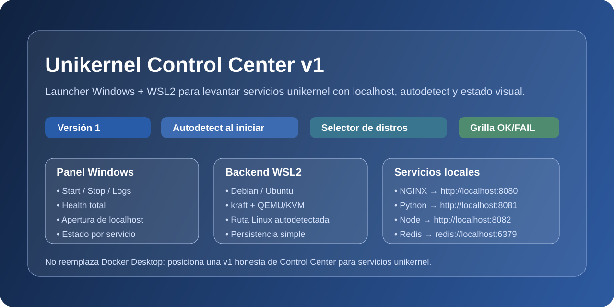
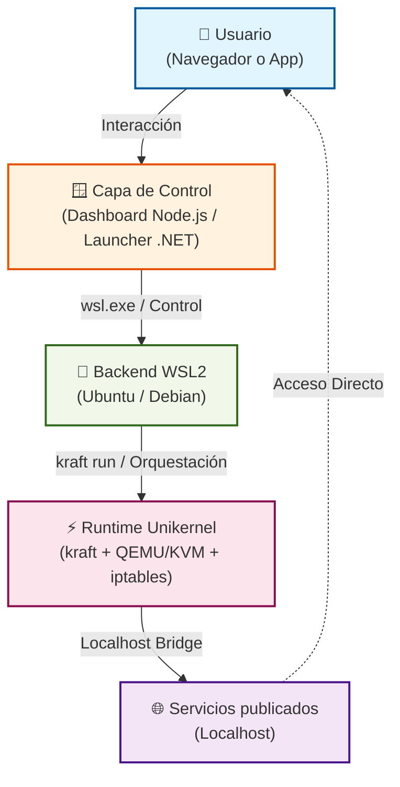

# 🪂 unikernel-labs



> 🚀 **Unikernel Control Center v1** — Suite profesional para el control total de servicios **Unikraft** desde Windows. Orquestación local transparente vía **WSL2**, gestión unificada con **Dashboard Node.js** y **Launcher WinForms**, y exposición activa en **localhost**. ⚡

[](https://github.com/vladimiracunadev-create/unikernel-labs/actions)
[](https://github.com/vladimiracunadev-create/unikernel-labs/actions)
[](https://github.com/vladimiracunadev-create/unikernel-labs/actions)
[](https://github.com/vladimiracunadev-create/unikernel-labs/releases)
[](https://github.com/vladimiracunadev-create/unikernel-labs)
[](docs/00-windows-and-wsl2.md)
[](LICENSE)

---

## 🗺️ Qué es este repo

Este repo junta tres piezas que trabajan sobre la misma idea:

| Pieza | Descripción |
|---|---|
| 🖥️ **Dashboard local** | API REST en Node.js, corre en Windows, publica en `http://localhost:9091` |
| 🪟 **Launcher WinForms** | Aplicación de escritorio Windows para gobernar labs |
| 🐧 **Labs unikernel** | Se ejecutan dentro de WSL2 usando `kraft` + QEMU/KVM |

### Arquitectura



> [!NOTE]
> No es un dashboard estático ni un runtime Windows nativo para `kraft`.
> Es una **capa de control Windows** sobre un runtime Linux real.

---

## ✅ Estado actual — v1 validado

Lo que hoy está implementado y documentado:

- ✅ Dashboard local con REST API en `localhost:9091`
- ✅ Diagnóstico de WSL, distro y versión de `kraft`
- ✅ Start, Stop, Logs y Health por lab
- ✅ Catálogo raíz en `labs.config.json`
- ✅ Scripts para sincronizar catálogo y verificar flujo localhost
- ✅ Launcher WinForms que consume el mismo set de labs
- ✅ Script y workflow para generar un instalador `.exe` de Windows
- ✅ Arranque real de `nginx-runtime` con respuesta en `http://localhost:8080`
- ✅ Build e instalación silenciosa del instalador

---

## 📚 Fuente de verdad del catálogo

El catálogo operativo principal es `labs.config.json`.

El launcher usa `launcher/windows/src/UnikernelLabs.Launcher/labs.windows.json`, que **se genera automáticamente**:

```powershell
# desde la raíz del repo
node scripts/sync-launcher-catalog.js
```

> [!IMPORTANT]
> No edites `labs.windows.json` a mano. Siempre edita `labs.config.json` y luego sincroniza.

---

## 🧩 Componentes principales

| Componente | Rol | Doc |
|---|---|---|
| `dashboard-server/server.js` | API local + puente Windows ↔ WSL | [docs/04](docs/04-windows-localhost-launcher.md) |
| `index.html` + `dashboard.js` + `dashboard.css` | UI web del dashboard | — |
| `labs.config.json` | Catálogo raíz de servicios | — |
| `scripts/sync-launcher-catalog.js` | Genera catálogo del launcher | [CONTRIBUTING](CONTRIBUTING.md) |
| `scripts/verify-localhost.js` | Smoke test del flujo localhost | [RUNBOOK](RUNBOOK.md) |
| `launcher/windows/src/UnikernelLabs.Launcher/` | App WinForms de escritorio | [launcher/README](launcher/README.md) |
| `01-hello-world` → `08-kraft-cloud-track` | Labs y pistas de trabajo | [docs/03](docs/03-lab-selection.md) |
| `windows/scripts/` | Helpers de entorno desde Windows | [windows/README](windows/README.md) |

---

## 🚀 Quickstart

### 1 · Preparar Windows + WSL

```powershell
wsl --install -d Ubuntu
```

Deja el repo en `C:\dev\unikernel-labs` para el flujo validado:

```powershell
git clone https://github.com/vladimiracunadev-create/unikernel-labs C:\dev\unikernel-labs
```

### 2 · Instalar dependencias en Ubuntu

```powershell
powershell -ExecutionPolicy Bypass -File .\windows\scripts\install-runtime-prereqs.ps1 -Distro Ubuntu
wsl.exe -u root -d Ubuntu -- bash -lc "apt-get update && apt-get install -y --no-install-recommends bison build-essential flex git libncurses-dev qemu-system socat unzip wget iptables"
```

### 3 · Instalar KraftKit

```powershell
wsl.exe -d Ubuntu -- bash /mnt/c/dev/unikernel-labs/scripts/install-kraft-wsl.sh
```

### 4 · Validar el entorno

```powershell
wsl.exe -d Ubuntu -- bash -lc "source ~/.profile; cd /mnt/c/dev/unikernel-labs && bash scripts/doctor.sh"
```

### 5 · Levantar el dashboard

```powershell
cd C:\dev\unikernel-labs
node dashboard-server/server.js
```

Abre → **[http://localhost:9091](http://localhost:9091)**

### 6 · Probar un lab real

```powershell
$headers = @{ 'X-UCC-Request'='1'; 'Origin'='http://127.0.0.1:9091' }
Invoke-RestMethod -Method Post -Headers $headers http://127.0.0.1:9091/api/labs/02/start
Invoke-RestMethod http://127.0.0.1:9091/api/labs/02/health
Invoke-WebRequest http://127.0.0.1:8080 -UseBasicParsing
```

> [!TIP]
> Consulta [`ENVIRONMENT_SETUP.md`](ENVIRONMENT_SETUP.md) para un walkthrough paso a paso completo.

---

## 🌐 Servicios localhost

| Servicio | Puerto | URL | Protocolo |
|---|---:|---|---|
| 🖥️ Dashboard local + API | 9091 | [http://localhost:9091](http://localhost:9091) | HTTP |
| 🌐 NGINX unikernel | 8080 | [http://localhost:8080](http://localhost:8080) | HTTP |
| 🐍 Python HTTP | 8081 | [http://localhost:8081](http://localhost:8081) | HTTP |
| 🟢 Node HTTP | 8082 | [http://localhost:8082](http://localhost:8082) | HTTP |
| 🗄️ Redis | 6379 | `redis://localhost:6379` | TCP |

---

## 🪟 Launcher Windows

```text
launcher/windows/src/UnikernelLabs.Launcher
```

La app de escritorio permite: `Start` · `Stop` · `Logs` · `Health` · `Open` · `Status` · autodetección de distros WSL.

Para publicar:

```powershell
powershell -ExecutionPolicy Bypass -File .\windows\scripts\build-windows-installer.ps1
```

Artefactos generados:

```text
artifacts/publish/win-x64/UnikernelLabs.Launcher.exe
artifacts/installer/UnikernelControlCenter-1.0.0-win-x64-setup.exe
```

📖 Más info → [`docs/05-packaging-and-publish.md`](docs/05-packaging-and-publish.md) · [`windows/PUBLISH_AND_INSTALL.md`](windows/PUBLISH_AND_INSTALL.md)

---

## 🧪 Verificación automatizada

```powershell
node scripts/verify-localhost.js
# o
make test-dashboard
```

El verificador comprueba:

- ✅ Resolución segura de archivos estáticos
- ✅ Truncado de logs
- ✅ Sincronización entre `labs.config.json` y `labs.windows.json`
- ✅ Smoke test de la API localhost

---

## 🧪 Labs disponibles

| # | Lab | Estado | Puerto |
|---|---|---|---:|
| 01 | [hello-world](01-hello-world/README.md) | ✅ ready | — |
| 02 | [nginx-runtime](02-nginx-runtime/README.md) | ✅ validado | 8080 |
| 03 | [python-http](03-python-http/README.md) | ✅ ready | 8081 |
| 04 | [node-http](04-node-http/README.md) | ✅ ready | 8082 |
| 05 | [redis-runtime](05-redis-runtime/README.md) | ✅ ready | 6379 |
| 06 | [benchmarks](06-benchmarks/README.md) | ⏳ pista | — |
| 07 | [runu-track](07-runu-track/README.md) | ⏳ pista | — |
| 08 | [kraft-cloud-track](08-kraft-cloud-track/README.md) | ⏳ pista | — |

---

## 📋 Lo que v1 promete · y lo que no

| ✅ Prometido | ❌ Fuera de alcance |
|---|---|
| Control local de servicios unikernel desde Windows | Runtime Windows nativo para `kraft` |
| Backend real en WSL2 | Reemplazo completo de Docker Desktop |
| Puertos estables en `localhost` | MSI firmado o auto-actualización |
| Lectura de logs y health checks básicos | Soporte uniforme para cualquier lab |
| Instalador `.exe` para la app Windows | — |

---

## 📖 Documentación clave

| Documento | Descripción |
|---|---|
| [RUNBOOK.md](RUNBOOK.md) | Comandos operativos del día a día |
| [ENVIRONMENT_SETUP.md](ENVIRONMENT_SETUP.md) | Setup completo paso a paso |
| [COMPATIBILITY.md](COMPATIBILITY.md) | Plataformas soportadas y riesgos |
| [CONTRIBUTING.md](CONTRIBUTING.md) | Cómo contribuir al proyecto |
| [ROADMAP.md](ROADMAP.md) | Versiones y features planeadas |
| [☁️ CLOUD_AWS_MIGRATION.md](CLOUD_AWS_MIGRATION.md) | Plan completo de migración a AWS (rutas, pasos, costos) |
| [FILE_ARCHITECTURE.md](FILE_ARCHITECTURE.md) | Árbol de archivos comentado |
| [docs/00-windows-and-wsl2.md](docs/00-windows-and-wsl2.md) | Modelo Windows + WSL2 |
| [docs/04-windows-localhost-launcher.md](docs/04-windows-localhost-launcher.md) | Launcher architecture |
| [docs/05-packaging-and-publish.md](docs/05-packaging-and-publish.md) | Empaquetado e instalador |
| [RECRUITER.md](RECRUITER.md) | Para recruiters / hiring managers |

---

## ⚖️ Licencia

Apache-2.0 · © vladimiracunadev-create
